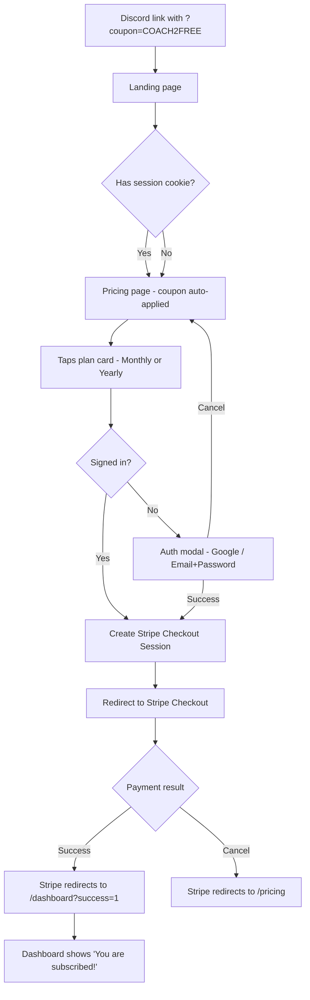
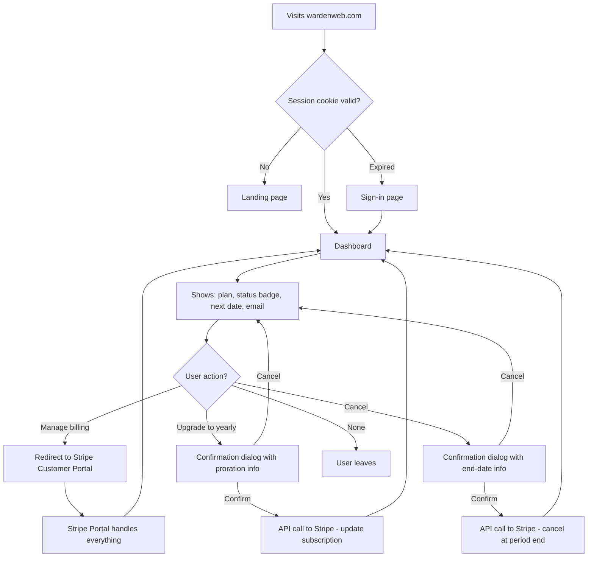
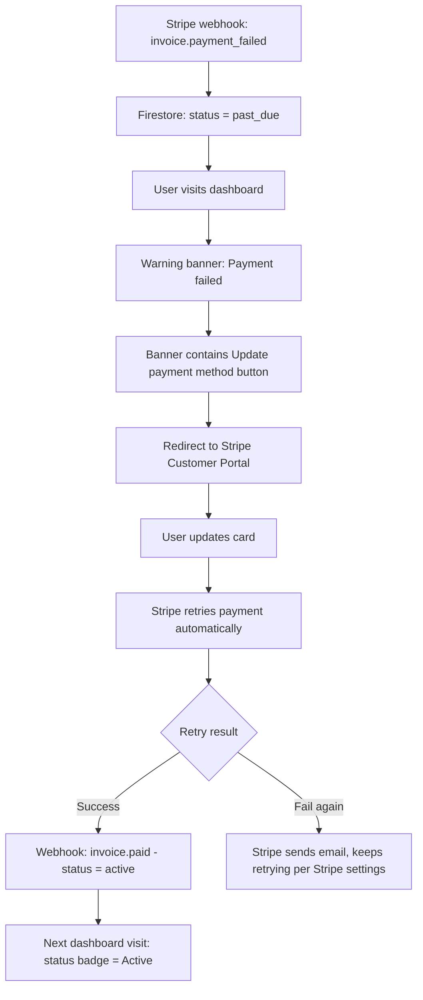
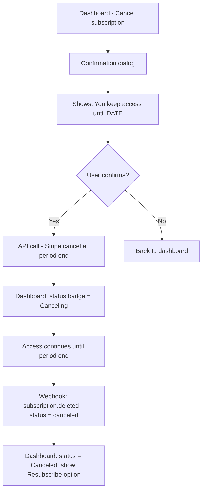
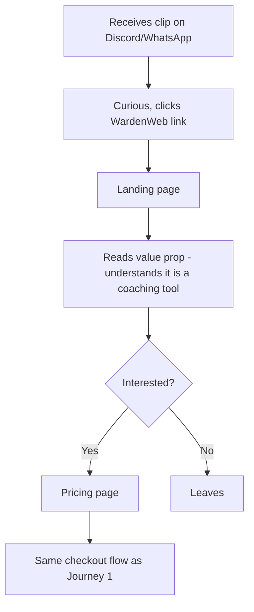

---
stepsCompleted:
  [
    'step-01-init',
    'step-02-discovery',
    'step-03-core-experience',
    'step-04-emotional-response',
    'step-05-inspiration',
    'step-06-design-system',
    'step-07-defining-experience',
    'step-08-visual-foundation',
    'step-09-design-directions',
    'step-10-user-journeys',
    'step-11-component-strategy',
    'step-12-ux-patterns',
    'step-13-responsive-accessibility',
    'step-14-complete',
  ]
lastStep: 14
status: 'complete'
completedAt: '2026-04-02'
inputDocuments:
  - '_bmad/planning-artifacts/product-brief-WardenWeb-2026-02-05.md'
  - '_bmad/planning-artifacts/prd.md'
  - '_bmad/planning-artifacts/architecture.md'
  - '_bmad/planning-artifacts/epics.md'
workflowType: 'ux-design'
project_name: 'WardenWeb'
user_name: 'Developer'
date: '2026-04-02'
---

# UX Design Specification WardenWeb

**Author:** Developer
**Date:** 2026-04-02

---

## Executive Summary

### Project Vision

WardenWeb is the subscription management portal for the Warden mobile app — a specialized video review tool for EVA After-h coaches. Following a "Reader App" model, it enables coaches to subscribe via web (bypassing app store fees) while providing a professional web presence for Discord-based marketing and word-of-mouth discovery. The portal handles the full subscription lifecycle: discovery, checkout, account management, and billing.

### Target Users

**Primary — The Coach (Thomas, 26):**
EVA After-h coach who reviews sessions after work from the couch. Discovers Warden via Discord word-of-mouth, arrives via coupon link. Needs a fast, trustworthy checkout experience with minimal friction. Returns occasionally for billing management (upgrade, cancel, update payment). Not a power user — values simplicity and clarity.

**Secondary — Passive Player turned Active:**
Team members who receive coach's clips on Discord/WhatsApp. Impressed by the quality (especially minimap view), they visit WardenWeb out of curiosity. The landing page must clearly communicate value even to non-coaches who want to self-analyze.

### Key Design Challenges

1. **Trust at first touch** — Coaches arrive from Discord links, often on mobile. The landing page must instantly feel professional and credible while communicating a niche product's value in seconds.
2. **Checkout conversion** — Users must create an account and enter payment in one flow, with optional coupon. This is the critical conversion moment — any friction loses potential subscribers.
3. **Dashboard clarity** — Subscription status, billing dates, payment failures, and actions must be immediately understandable for users who visit rarely and aren't power users.

### Design Opportunities

1. **Coupon-first flow** — Most coaches arrive via coupon link. Designing around "you won't be charged until [date]" reduces checkout anxiety and increases conversion.
2. **Mobile-couch context** — The primary user is tired, on their phone, relaxing. Large touch targets, minimal reading, and a dark-mode-friendly aesthetic match this context.
3. **Gaming/tactical identity** — Leaning into EVA's tactical visual language creates instant recognition and community trust without feeling generic.

## Core User Experience

### Defining Experience

WardenWeb is a minimal subscription portal — a thin layer that connects coaches to Stripe. The site has three jobs:

1. **Explain what Warden is** (landing page)
2. **Get the user into Stripe Checkout** (pricing page)
3. **Show subscription status and link to Stripe Portal** (dashboard)

Everything payment-related lives in Stripe: checkout, card management, invoices, cancellation. WardenWeb displays state and hands off to Stripe for actions.

**Design priority:** Working first, polished later. No app screenshots (app not finished), no testimonials, no social proof. Clean, functional, ships fast.

### Platform Strategy

| Aspect             | Decision                              | Rationale                                               |
| ------------------ | ------------------------------------- | ------------------------------------------------------- |
| Primary platform   | Mobile web (touch)                    | Coaches arrive from Discord links on phones             |
| Secondary platform | Desktop web                           | Some users may subscribe from PC                        |
| Design approach    | Mobile-first, progressive enhancement | 320px-768px primary viewport                            |
| Stripe delegation  | Maximum                               | Checkout Session, Customer Portal, hosted invoice pages |
| Complexity         | Minimal                               | Working site first, design improvements later           |

### Effortless Interactions

| Interaction      | Approach                                                            |
| ---------------- | ------------------------------------------------------------------- |
| Checkout         | Redirect to Stripe Checkout Session — Stripe handles all payment UI |
| Coupon           | Pass coupon code to Stripe Checkout Session via URL param           |
| Card update      | Link to Stripe Customer Portal                                      |
| Payment history  | Link to Stripe Customer Portal                                      |
| Upgrade          | Stripe Customer Portal or API call + confirmation                   |
| Cancel           | Stripe Customer Portal or API call + confirmation                   |
| Account creation | Google one-tap or email/password at checkout time                   |

### Critical Success Moments

1. **"I won't be charged yet"** — Stripe Checkout shows deferred billing when coupon is applied
2. **"That was fast"** — Landing -> Pricing -> Stripe Checkout in 3 clicks
3. **"I can see my status"** — Dashboard shows plan + status + next date at a glance
4. **"I can manage everything"** — One link to Stripe Customer Portal handles billing needs

### Experience Principles

1. **Ship working, polish later** — Functional pages with clean layout. No placeholder content, no fake screenshots, no testimonials. What exists works; what doesn't exist isn't faked.
2. **Stripe does payments** — Redirect to Stripe Checkout, link to Stripe Portal. Don't rebuild what Stripe already provides.
3. **Minimal pages, clear purpose** — Landing (what is Warden), Pricing (pick a plan), Dashboard (your account), Legal (privacy/terms). Nothing else.
4. **Trust through transparency** — Show billing dates, plan details, and status. No surprises.

## Desired Emotional Response

### Primary Emotional Goals

| Stage             | Desired Feeling                                 | Why it matters                                    |
| ----------------- | ----------------------------------------------- | ------------------------------------------------- |
| Landing page      | **Clarity** — "I get what this is"              | Coach decides in 5 seconds if this is legit       |
| Pricing page      | **Confidence** — "Fair price, no tricks"        | Transparent pricing removes hesitation            |
| Checkout (Stripe) | **Safety** — "This is a real payment page"      | Stripe's branded checkout provides built-in trust |
| Dashboard         | **Control** — "I can see and manage everything" | Subscriber never feels trapped or confused        |
| Error state       | **Calm** — "I know what to do"                  | Payment failure shows clear next step, not panic  |

### Emotional Journey Mapping

```
Discord link -> Curiosity ("what's this?")
    -> Landing -> Clarity ("oh, it's a coaching tool")
    -> Pricing -> Confidence ("simple pricing, coupon works")
    -> Stripe Checkout -> Safety ("recognized payment flow")
    -> Dashboard -> Control ("I see my plan, I can manage it")
    -> Return visit -> Familiarity ("I know where everything is")
```

### Micro-Emotions

| Prioritize                | Avoid                                    |
| ------------------------- | ---------------------------------------- |
| Confidence over confusion | No ambiguous CTAs or unclear pricing     |
| Trust over skepticism     | No dark patterns, no hidden fees         |
| Calm over anxiety         | No urgency tricks, no countdown timers   |
| Control over helplessness | Always show a clear action for any state |

### Design Implications

| Emotional Goal | UX Decision                                                              |
| -------------- | ------------------------------------------------------------------------ |
| Clarity        | Short copy, one CTA per page, no jargon                                  |
| Confidence     | Prices visible upfront, coupon effect shown immediately                  |
| Safety         | Stripe Checkout (not custom payment form), HTTPS badge visible           |
| Control        | Dashboard shows all status info at a glance, all actions accessible      |
| Calm           | Error states include specific next step, not just "something went wrong" |

### Emotional Design Principles

1. **Boring is good** — A subscription portal shouldn't be exciting. It should be invisible. Users should accomplish their goal and forget about it.
2. **No dark patterns** — No fake urgency, no hidden cancellation flows, no guilt-tripping on cancel. Coaches talk to each other on Discord — one bad experience spreads fast.
3. **Error = action** — Every error state tells the user exactly what to do next. Never show a dead end.

## UX Pattern Analysis & Inspiration

### Inspiring Products Analysis

**Discord (community platform coaches live in):**

- Dark theme as default — gaming audiences expect it
- Clean card-based layouts for subscription tiers (Nitro page)
- Minimal copy, icons do the talking
- Checkout is fast — few steps, Stripe-powered behind the scenes

**Stripe Checkout (the actual checkout coaches will see):**

- Trusted, recognized payment UI — no need to reinvent
- Handles coupon display, billing date, plan summary natively
- Mobile-optimized out of the box

**Valorant/Riot Games web pages (gaming visual language):**

- Dark backgrounds with accent color pops
- Bold typography, short punchy headlines
- Geometric/angular design elements feel tactical
- Imagery-light versions still feel premium with good typography and color

### Transferable UX Patterns

| Pattern                   | Source                    | Apply to WardenWeb                                       |
| ------------------------- | ------------------------- | -------------------------------------------------------- |
| Dark theme default        | Discord, gaming sites     | Landing, pricing, dashboard — dark bg with accent colors |
| Card-based plan selection | Discord Nitro, most SaaS  | Pricing page — two cards, monthly vs yearly              |
| Minimal hero + single CTA | Modern SaaS landing pages | Landing page — headline, one-liner, "See pricing" button |
| Status badge system       | Discord, gaming UIs       | Dashboard — colored badges for active/past_due/canceled  |
| Stripe-hosted checkout    | Stripe best practice      | Redirect to Stripe, don't build custom payment form      |
| Stripe Customer Portal    | Stripe best practice      | Link from dashboard for all billing management           |

### Anti-Patterns to Avoid

| Anti-Pattern                              | Why avoid it                                            |
| ----------------------------------------- | ------------------------------------------------------- |
| Light/corporate SaaS aesthetic            | Feels out of place for gaming audience, kills trust     |
| Long scrolling landing page with sections | No testimonials, no screenshots — keep it short         |
| Custom payment forms                      | Stripe Checkout is more trusted and handles edge cases  |
| Feature comparison tables                 | Only 2 plans that differ by billing cycle, not features |
| Animated illustrations/Lottie             | Adds complexity, delays ship date, not needed           |
| Stock photos of "happy teams"             | Gaming audience sees through generic imagery instantly  |

### Design Inspiration Strategy

**Adopt:**

- Dark theme with accent color (gaming-native, Discord-familiar)
- Card-based pricing (proven pattern, simple to implement)
- Stripe Checkout redirect (maximum delegation)
- Badge-based status display (clear, scannable)

**Adapt:**

- Gaming typography (bold, angular) — but use system/Google fonts, not custom font files, to ship fast
- Geometric accent elements — subtle, CSS-only, no custom graphics needed for V1

**Avoid:**

- Corporate SaaS look (white bg, blue accents, stock imagery)
- Heavy illustration or animation
- Long-form content pages
- Anything that requires design assets that don't exist yet

## Design System Foundation

### Design System Choice

**shadcn/ui** — Radix UI primitives styled with Tailwind CSS.

This is a copy-paste component library (not an npm dependency). You own every component file, can customize freely, and it ships with accessible defaults.

### Rationale for Selection

| Factor                 | How shadcn/ui fits                                                                           |
| ---------------------- | -------------------------------------------------------------------------------------------- |
| Speed                  | Pre-built components (Button, Card, Badge, Dialog, Input, Alert, Skeleton) — install and use |
| Dark theme             | Tailwind CSS dark mode built-in, shadcn/ui supports theming via CSS variables                |
| Gaming aesthetic       | Full control over colors, typography, spacing — not locked into a "corporate" look           |
| Accessibility          | Radix UI primitives handle focus, keyboard nav, screen readers (WCAG 2.1 A)                  |
| Maintenance            | No library updates to break things — you own the code                                        |
| Team size              | Solo dev / AI-assisted — copy-paste is simpler than learning a framework API                 |
| Architecture alignment | Already decided in architecture.md — no new decision needed                                  |

### Implementation Approach

1. Initialize shadcn/ui with `components.json` config (dark theme default)
2. Install only needed components: Button, Card, Badge, Dialog, Input, Alert, Skeleton
3. Configure Tailwind CSS variables for gaming color palette
4. Components live in `src/components/ui/`

### Customization Strategy

| What                        | How                                                                 |
| --------------------------- | ------------------------------------------------------------------- |
| Dark theme                  | Set as default via Tailwind `darkMode: "class"` + CSS variables     |
| Color palette               | Override shadcn/ui CSS variables with gaming-inspired accent colors |
| Typography                  | Bold, clean Google Font — configured in Tailwind theme              |
| Border radius               | Slightly sharper corners for tactical/angular feel                  |
| Spacing                     | Generous touch targets (min 44px) for mobile-first                  |
| No custom components for V1 | shadcn/ui primitives cover all MVP needs                            |

## Defining User Experience

### Defining Experience

**"Subscribe from a Discord link in under 60 seconds."**

That's the one-liner a coach would use to describe WardenWeb. The site isn't the product — the Warden mobile app is. WardenWeb is the door to get in. The best door is the one you barely notice opening.

### User Mental Model

Coaches arrive with a simple mental model: **"I got a link, I want to try this app."**

| What they expect             | What we deliver                    |
| ---------------------------- | ---------------------------------- |
| Click link -> see what it is | Landing page with clear value prop |
| See price -> decide          | Pricing page with 2 simple options |
| Pay -> done                  | Stripe Checkout handles everything |
| Come back -> check my stuff  | Dashboard with status at a glance  |

**No learning curve.** Coaches have subscribed to things before (Discord Nitro, Netflix, game passes). They know how subscription sites work. We follow the pattern exactly.

### Success Criteria

| Criteria         | Measure                                                       |
| ---------------- | ------------------------------------------------------------- |
| Checkout speed   | Discord link -> subscribed in < 60 seconds                    |
| Zero confusion   | No "where do I click?" moments — one CTA per page             |
| Stripe trust     | Payment page is recognizably Stripe, not a custom form        |
| Dashboard glance | Plan + status + next date visible without scrolling           |
| Self-service     | Upgrade, cancel, update card — all without contacting support |

### Novel UX Patterns

**None.** This is intentional.

Every interaction uses established patterns that coaches already understand:

- Landing page hero + CTA (standard SaaS)
- Card-based pricing (Discord Nitro, every SaaS)
- Stripe Checkout redirect (millions of sites)
- Dashboard with status cards (every account page)
- Stripe Customer Portal for billing management (Stripe standard)

**The innovation is in what we remove, not what we add.** No onboarding wizard, no feature tour, no email verification wall, no profile setup. Subscribe and go.

### Experience Mechanics

**Flow 1: New Subscriber (coupon link from Discord)**

```
1. INITIATION: Coach taps Discord link with coupon param
2. LANDING: Sees headline + "See pricing" CTA (5 sec)
3. PRICING: Two cards (monthly/yearly), coupon auto-shown, taps plan (5 sec)
4. AUTH: Google one-tap or email/password (10 sec)
5. CHECKOUT: Stripe Checkout page, coupon applied, sees "first charge: [date]" (15 sec)
6. DONE: Redirect to dashboard with "You're subscribed!" confirmation
```

**Flow 2: Returning Subscriber (dashboard visit)**

```
1. INITIATION: Coach visits WardenWeb, auto-signed-in via session cookie
2. DASHBOARD: Sees plan, status badge, next payment date
3. ACTION (if needed): Taps "Manage billing" -> Stripe Customer Portal
4. DONE: Returns to dashboard, updated state reflected
```

**Flow 3: Payment Failure Recovery**

```
1. TRIGGER: Coach signs in, dashboard shows "Payment failed" alert
2. ACTION: Alert contains "Update payment method" link
3. RESOLUTION: Stripe Customer Portal -> update card -> auto-retry
4. DONE: Next dashboard visit shows "Active" status
```

## Visual Design Foundation

### Color System

**Brand Colors (extracted from logo):**

| Role             | Color           | Hex       | Usage                        |
| ---------------- | --------------- | --------- | ---------------------------- |
| Background       | Near-black      | `#0F0F0F` | Page backgrounds             |
| Surface          | Dark charcoal   | `#1A1A1A` | Cards, panels, nav           |
| Surface elevated | Medium charcoal | `#252525` | Hover states, elevated cards |
| Border           | Dark gray       | `#333333` | Subtle borders, dividers     |
| Text primary     | Off-white       | `#F0F0F0` | Headings, body text          |
| Text secondary   | Medium gray     | `#999999` | Captions, labels             |
| Accent primary   | Warden orange   | `#E8731A` | CTAs, active states, links   |
| Accent hover     | Bright orange   | `#F28A2E` | Button hover, link hover     |
| Success          | Green           | `#22C55E` | Active subscription badge    |
| Warning          | Amber           | `#F59E0B` | Past-due status              |
| Error            | Red             | `#EF4444` | Payment failed, errors       |

**Contrast ratios (WCAG 2.1 A):**

- Text primary on Background: ~16:1 (passes AAA)
- Text secondary on Background: ~5.5:1 (passes AA)
- Accent orange on Background: ~4.8:1 (passes AA for large text, use bold)

### Typography System

| Role            | Font  | Weight          | Size (mobile)   | Size (desktop)  |
| --------------- | ----- | --------------- | --------------- | --------------- |
| H1 (hero)       | Inter | 800 (ExtraBold) | 2rem / 32px     | 3rem / 48px     |
| H2 (section)    | Inter | 700 (Bold)      | 1.5rem / 24px   | 2rem / 32px     |
| H3 (card title) | Inter | 600 (SemiBold)  | 1.25rem / 20px  | 1.5rem / 24px   |
| Body            | Inter | 400 (Regular)   | 1rem / 16px     | 1rem / 16px     |
| Small / label   | Inter | 500 (Medium)    | 0.875rem / 14px | 0.875rem / 14px |
| Badge           | Inter | 600 (SemiBold)  | 0.75rem / 12px  | 0.75rem / 12px  |

**Font choice: Inter** — clean, geometric, highly legible, free Google Font. Works at all sizes, feels modern without being flashy. Ships fast (no custom font licensing).

**Line heights:** 1.2 for headings, 1.5 for body text.

### Spacing & Layout Foundation

**Base unit:** 4px

| Token      | Value | Usage                               |
| ---------- | ----- | ----------------------------------- |
| `space-1`  | 4px   | Tight gaps (badge padding)          |
| `space-2`  | 8px   | Icon gaps, inline spacing           |
| `space-3`  | 12px  | Card internal padding (mobile)      |
| `space-4`  | 16px  | Card internal padding, section gaps |
| `space-6`  | 24px  | Between components                  |
| `space-8`  | 32px  | Section spacing (mobile)            |
| `space-12` | 48px  | Section spacing (desktop)           |
| `space-16` | 64px  | Page-level vertical rhythm          |

**Layout:**

- Max content width: 1024px (centered)
- Page padding: 16px (mobile), 32px (desktop)
- No complex grid — single column mobile, max 2 columns for pricing cards
- Min touch target: 44x44px

**Border radius:**

- Buttons: 6px (slightly sharp, tactical feel)
- Cards: 8px
- Badges: 4px
- Full round: avatar/status dots only

### Accessibility Considerations

| Requirement              | Implementation                                       |
| ------------------------ | ---------------------------------------------------- |
| Color contrast           | All text meets WCAG AA (4.5:1 normal, 3:1 large)     |
| Focus indicators         | Orange outline (2px) on focus-visible, high contrast |
| Touch targets            | Min 44x44px on all interactive elements              |
| Font sizing              | Base 16px, no text smaller than 12px                 |
| Color not sole indicator | Badges use text labels + color (not color alone)     |
| Reduced motion           | Respect `prefers-reduced-motion` media query         |

## Design Direction Decision

### Design Directions Explored

Three directions were generated and compared via interactive HTML mockups (`ux-design-directions.html`):

- **Direction A: Clean Minimal** — Soft borders, rounded cards, subtle orange accents, generous whitespace. Quiet confidence.
- **Direction B: Bold Tactical** — Hard edges, uppercase typography, orange top border, grid layouts. War room aesthetic.
- **Direction C: Warm & Approachable** — Rounded corners, emoji accents, friendly tone, spacious. Coach-friendly feel.

### Chosen Direction

**Direction A: Clean Minimal**

### Design Rationale

| Factor                  | Why Direction A                                                                      |
| ----------------------- | ------------------------------------------------------------------------------------ |
| Ship speed              | Simplest to implement — standard card/button patterns, no custom decorative elements |
| Gaming without gimmicks | Dark theme reads as gaming-native without heavy-handed tactical typography           |
| Stripe alignment        | Understated style matches Stripe Checkout's clean aesthetic — seamless handoff       |
| Mobile readability      | Good contrast, clear hierarchy, large touch targets without visual clutter           |
| Future-proof            | Clean base is easy to polish later — adding visual flair is easier than removing it  |

### Implementation Approach

| Element   | Direction A Specifics                                                                 |
| --------- | ------------------------------------------------------------------------------------- |
| Nav       | Logo text left, links right, no background — just bottom border on scroll             |
| Hero      | Centered headline + subtext + single CTA button                                       |
| Cards     | `#1A1A1A` background, `#333` border, 8px radius, subtle hover border change to orange |
| Buttons   | Orange fill, white text, 6px radius, full-width inside cards                          |
| Badges    | Small, 4px radius, colored background at 15% opacity + matching text                  |
| Dashboard | Single status card with label/value rows, action buttons stacked below                |
| Warnings  | Colored border + background at 10% opacity, clear action button inside                |
| Footer    | Centered, minimal — Privacy / Terms / copyright                                       |

## User Journey Flows

### Journey 1: New Subscriber (Coupon from Discord)

The primary conversion flow — coach taps a Discord link and subscribes.



**Key UX decisions:**

- Coupon is extracted from URL param and shown on pricing page automatically
- Auth happens inline (modal) — user stays on pricing page context
- Stripe Checkout is a full redirect (not embedded) — maximum trust
- Success redirect lands on dashboard with confirmation state

### Journey 2: Returning Subscriber — Dashboard Visit



**Key UX decisions:**

- Session cookie auto-signs in returning users — no login friction
- Dashboard is a single card with all info visible without scrolling
- "Manage billing" goes to Stripe Customer Portal for card updates and invoice history
- Upgrade and cancel use confirmation dialogs (not separate pages)

### Journey 3: Payment Failure Recovery



**Key UX decisions:**

- Warning banner is prominent but not blocking — user can still see their info
- Single action button in the banner — no ambiguity about what to do
- Stripe handles the retry logic entirely — WardenWeb just reflects state

### Journey 4: Cancellation



**Key UX decisions:**

- Cancel is immediate but access continues until period end — clearly communicated
- No guilt-trip, no exit survey (MVP) — just honest confirmation
- After cancellation, dashboard shows resubscribe path

### Journey 5: Passive Player Discovery



**Key UX decisions:**

- Landing page copy works for both coaches AND players
- No separate onboarding — same flow for everyone
- Value prop must be clear without app screenshots (app not finished)

### Journey Patterns

| Pattern             | Usage                        | Implementation                                                            |
| ------------------- | ---------------------------- | ------------------------------------------------------------------------- |
| Stripe redirect     | Checkout, billing management | Full-page redirect, return URL back to WardenWeb                          |
| Confirmation dialog | Upgrade, cancel              | shadcn/ui Dialog with clear action + consequences                         |
| Status badge        | Dashboard                    | Colored badge: green/active, amber/past_due, red/canceled, gray/canceling |
| Warning banner      | Payment failure              | Full-width alert at top of dashboard with action button                   |
| Auth modal          | Sign in before checkout      | Modal overlay on pricing page, Google + email options                     |

### Flow Optimization Principles

1. **No dead ends** — Every state has a clear next action (even canceled shows resubscribe)
2. **Stripe handles payment UI** — Never build custom payment forms or card update screens
3. **Confirm before destructive** — Upgrade and cancel always show a dialog with consequences
4. **State comes from webhooks** — Dashboard always reflects Firestore state, which is updated by Stripe webhooks
5. **Auth is lazy** — Don't ask users to sign in until they've chosen a plan and are ready to pay

## Component Strategy

### Design System Components (shadcn/ui)

| Component | Where Used                                | Customization                                       |
| --------- | ----------------------------------------- | --------------------------------------------------- |
| Button    | CTAs on every page, dialog actions        | Orange fill for primary, ghost for secondary        |
| Card      | Pricing cards, dashboard status card      | Dark surface bg, subtle border                      |
| Dialog    | Upgrade confirmation, cancel confirmation | Standard with clear action buttons                  |
| Input     | Email/password auth form, coupon input    | Dark surface bg, orange focus ring                  |
| Badge     | Subscription status on dashboard          | Custom colors per status (active/past_due/canceled) |
| Alert     | Payment failure warning banner            | Warning variant with action button                  |
| Skeleton  | Dashboard loading state                   | Matches card layout dimensions                      |

**Coverage: 100% of MVP needs.** No custom components required.

### Custom Compositions (not components)

These are page-level compositions built from shadcn/ui primitives — not reusable components, just layouts:

| Composition    | Page      | Built From                                       |
| -------------- | --------- | ------------------------------------------------ |
| Hero section   | Landing   | Heading + paragraph + Button                     |
| Feature row    | Landing   | 3x small Cards with icon + text                  |
| Plan selector  | Pricing   | 2x Cards with price + Button                     |
| Coupon banner  | Pricing   | Alert variant with coupon info                   |
| Status card    | Dashboard | Card with label/value rows + Badges              |
| Action list    | Dashboard | Stack of ghost Buttons with arrows               |
| Warning banner | Dashboard | Alert with Button inside                         |
| Auth modal     | Pricing   | Dialog with Input + Button (Google + email form) |
| Nav bar        | All pages | Flex row: logo text + nav links                  |
| Footer         | All pages | Flex row: legal links + copyright                |

### Component Implementation Strategy

**Principle: No custom components for MVP.**

- Install only the 7 shadcn/ui components listed above
- Compose pages directly from these primitives
- Style via Tailwind classes + CSS variables (dark theme + orange accents)
- No component abstractions, no wrapper components, no design system extensions
- If a pattern repeats across pages, extract it later — not preemptively

### Implementation Roadmap

**All components ship together with their page — no phased component rollout.**

| Epic                          | Components Installed     |
| ----------------------------- | ------------------------ |
| Epic 1 (Foundation + Landing) | Button, Card, Skeleton   |
| Epic 2 (Auth)                 | Dialog, Input + above    |
| Epic 3 (Checkout)             | Alert, Badge + above     |
| Epic 5 (Dashboard)            | All 7 already installed  |
| Epic 6 (Legal)                | No new components needed |

## UX Consistency Patterns

### Button Hierarchy

| Level       | Style                      | Usage                          | Example                                             |
| ----------- | -------------------------- | ------------------------------ | --------------------------------------------------- |
| Primary     | Orange fill, white text    | One per page — the main action | "See pricing", "Subscribe", "Update payment method" |
| Secondary   | Ghost/outline, gray text   | Supporting actions             | "Manage billing", "Cancel subscription"             |
| Destructive | Ghost, red text            | Irreversible actions           | "Cancel subscription" (inside confirmation dialog)  |
| Link        | Text only, orange on hover | Navigation                     | "Sign in", "Privacy", "Terms"                       |

**Rules:**

- Max one primary button visible at a time per section
- Primary buttons are always full-width inside cards on mobile
- Destructive actions always require confirmation dialog first

### Feedback Patterns

| Type    | Component                       | Color | When                                              |
| ------- | ------------------------------- | ----- | ------------------------------------------------- |
| Success | Temporary banner or redirect    | Green | After successful checkout (redirect to dashboard) |
| Error   | Alert banner at top of content  | Red   | API errors, auth failures                         |
| Warning | Alert banner with action button | Amber | Payment failed, subscription expiring             |
| Loading | Skeleton components             | Gray  | Dashboard initial load, any async data fetch      |

**Rules:**

- Success states are transient — show briefly then fade or redirect
- Error states include a retry action or clear next step
- Warning states persist until resolved (not dismissible)
- Loading states match the layout shape of the content they replace

### Form Patterns

| Pattern                    | Implementation                                                          |
| -------------------------- | ----------------------------------------------------------------------- |
| Auth form (email/password) | Stacked inputs inside Dialog, Google button above as primary option     |
| Coupon input               | Single Input with inline validation — shows discount effect immediately |
| No other forms             | Everything else is handled by Stripe (checkout, card update)            |

**Validation rules:**

- Validate on blur (not on keystroke)
- Show error text below input in red
- Orange focus ring on active input
- Disable submit button until form is valid

### Navigation Patterns

| Pattern           | Implementation                                                                      |
| ----------------- | ----------------------------------------------------------------------------------- |
| Header nav        | Logo left, page links right. Links: Home, Pricing (public) or Dashboard (signed in) |
| Page transitions  | Standard Next.js navigation — no custom animations for MVP                          |
| Auth state in nav | Show "Sign in" when anonymous, "Sign out" when authenticated                        |
| Footer            | Centered row: Privacy / Terms / copyright. Same on every page                       |
| Back navigation   | Browser back button only — no custom back links needed                              |

**Rules:**

- Nav is fixed/sticky — always visible
- No hamburger menu needed — only 2-3 links, always visible even on mobile
- Active page link has orange text color

### Loading & Empty States

| State                 | Pattern                                                      |
| --------------------- | ------------------------------------------------------------ |
| Dashboard loading     | Skeleton card matching status card shape                     |
| No subscription       | Dashboard shows "No active subscription" + link to pricing   |
| Canceled subscription | Dashboard shows status + "Resubscribe" button                |
| Auth loading          | Full-page centered spinner while session is verified         |
| Stripe redirect       | Button shows loading spinner while creating checkout session |

### Modal Patterns

| Modal                | Content                                     | Actions                            |
| -------------------- | ------------------------------------------- | ---------------------------------- |
| Auth modal           | Google sign-in button + email/password form | Sign in / Cancel                   |
| Upgrade confirmation | Current plan, new plan, proration amount    | Confirm upgrade / Cancel           |
| Cancel confirmation  | "Access until [date]" message               | Confirm cancel / Keep subscription |

**Rules:**

- Modals always have a clear close/cancel action
- Confirm button is primary (orange) for positive actions, destructive (red) for cancel subscription
- Background overlay closes modal on click

## Responsive Design & Accessibility

### Responsive Strategy

**Approach: Mobile-first, progressive enhancement.**

The site is simple enough that responsive design is straightforward — single column on mobile, same single column on desktop but wider with centered max-width.

| Page      | Mobile (320-767px)                      | Desktop (1024px+)                             |
| --------- | --------------------------------------- | --------------------------------------------- |
| Landing   | Full-width hero, stacked features       | Same layout, wider max-width, features in row |
| Pricing   | Stacked plan cards                      | Side-by-side plan cards                       |
| Dashboard | Full-width status card, stacked actions | Same layout, wider card                       |
| Legal     | Full-width text                         | Narrower text column for readability          |

**No tablet-specific layouts.** The mobile layout works fine on tablet — no complex grid rearrangements needed.

### Breakpoint Strategy

| Breakpoint | Tailwind            | What changes                                                          |
| ---------- | ------------------- | --------------------------------------------------------------------- |
| Mobile     | Default (no prefix) | Base layout — everything stacked, full-width                          |
| Desktop    | `md:` (768px+)      | Pricing cards side-by-side, feature row horizontal, larger typography |

**Only one breakpoint.** Two layouts total: stacked (mobile) and side-by-side (desktop). Keeps CSS minimal and implementation fast.

### Accessibility Strategy

**Target: WCAG 2.1 Level A** (per PRD NFR17)

| Requirement         | Implementation                                                      |
| ------------------- | ------------------------------------------------------------------- |
| Color contrast      | Already validated in visual foundation — all text passes AA         |
| Keyboard navigation | shadcn/ui Radix primitives handle this by default                   |
| Focus indicators    | 2px orange outline on `:focus-visible`                              |
| Touch targets       | Min 44x44px on all buttons and links                                |
| Semantic HTML       | Proper heading hierarchy (h1 > h2 > h3), nav/main/footer landmarks  |
| Alt text            | Logo image gets alt text; no other images for MVP                   |
| Form labels         | All inputs have associated labels (shadcn/ui Input handles this)    |
| Skip link           | "Skip to content" link hidden until focused                         |
| Reduced motion      | `prefers-reduced-motion` respected — no animations for MVP anyway   |
| Screen reader       | Status badges include text (not color-only), alert role on warnings |

### Testing Strategy

**MVP testing — pragmatic, not exhaustive:**

| Test                     | Tool                                     | When               |
| ------------------------ | ---------------------------------------- | ------------------ |
| Contrast check           | Browser DevTools accessibility audit     | During development |
| Keyboard nav             | Manual tab-through each page             | Before launch      |
| Mobile layout            | Chrome DevTools device mode + real phone | During development |
| Lighthouse accessibility | `npx lighthouse`                         | CI pipeline        |
| Screen reader            | VoiceOver (macOS/iOS) quick pass         | Before launch      |

**No formal accessibility audit for MVP.** Radix UI primitives + semantic HTML + contrast compliance covers Level A. Full audit deferred to post-MVP.

### Implementation Guidelines

**For AI agents building pages:**

1. Always use semantic HTML: `<nav>`, `<main>`, `<footer>`, `<h1>`-`<h3>`, `<button>` (not `<div onClick>`)
2. Mobile styles first, desktop overrides with `md:` prefix
3. All interactive elements min 44x44px (`min-h-11 min-w-11`)
4. Never use color as the sole indicator — always pair with text or icon
5. Images get `alt` attributes; decorative elements get `alt=""`
6. Form inputs always have `<label>` elements
7. Use `rem` for font sizes, never `px`
8. Test each page with keyboard only (Tab, Enter, Escape) before marking done
